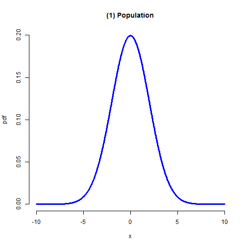
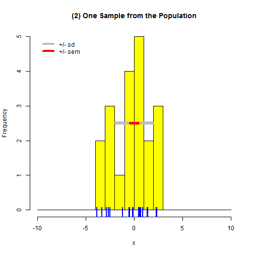
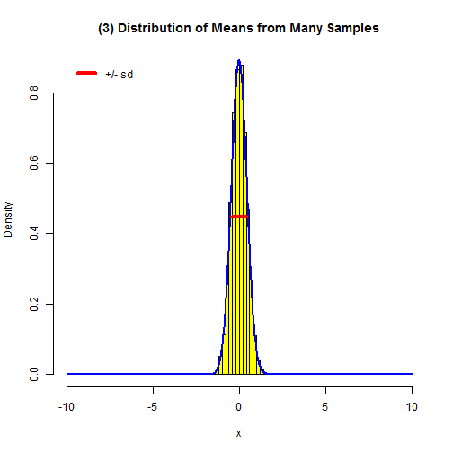

A Demo of Sampling, Standard Deviation, and Standard Error Concepts
========================================================
author: Dinesh Srivastava
date: October 26th, 2014
transition: rotate

Overview
========================================================

This example demonstrates the relationship between the standard deviation of a population, the standard deviation and standard error of the mean for a sample drawn from that population, and the expected distribution of means that we would obtain if we took many samples (of the same size) from the population.

New few slides analyzes:

1. Standard deviation of a population
2. Standard deviation and standard error of the mean for a sample drawn from the population
3. Expected distribution of means from the population

1. Standard deviation of a population
========================================================

```r
#Assume a Population Standard Deviation of 2 in a Sample Size of 20.
```

 


2. Standard deviation and standard error of the mean
========================================================


```r
#Assume a Population Standard Deviation of 2 in a Sample Size of 20.
```

 


3. Expected distribution of means
========================================================


```r
#Assume a Population Standard Deviation of 2 in a Sample Size of 20.
```

 
